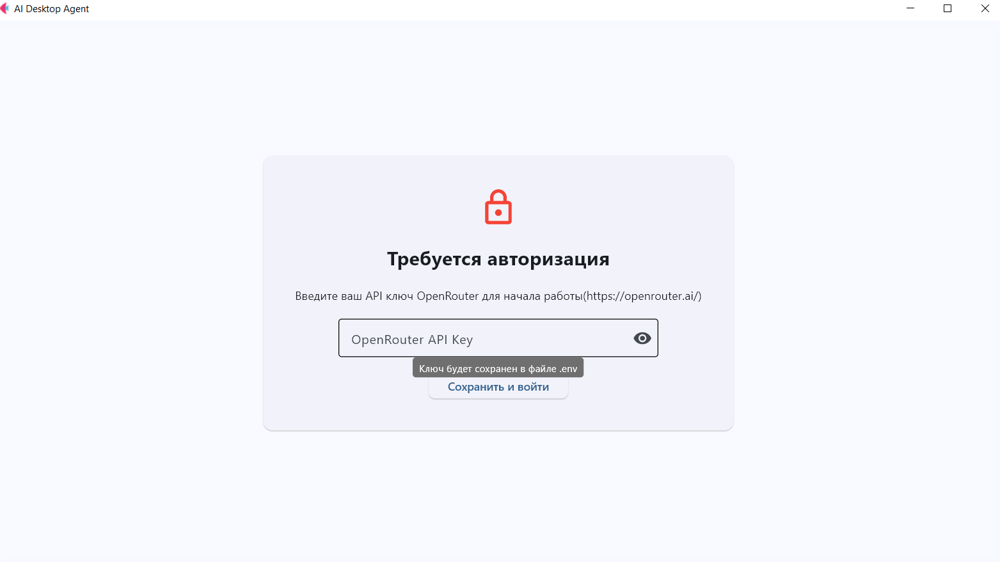
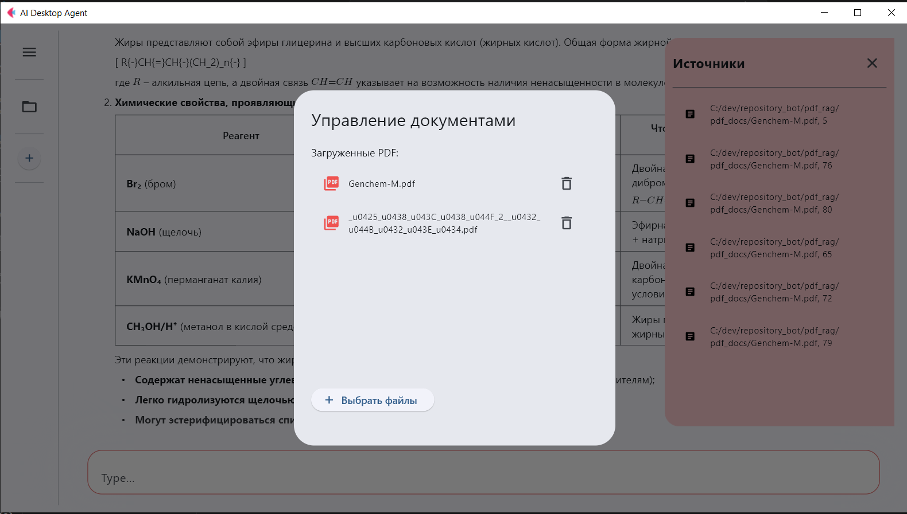

# 🤖 Chembot AI Agent

Десктопный ассистент для анализа документов и поиска информации. Объединяет ваши локальные PDF-файлы, базу лекций и поиск в интернете (Arxiv, DuckDuckGo) в едином интерфейсе.

## 🛠 Возможности

*   **Поиск по PDF (RAG):** Извлекает информацию из ваших документов и университетских лекций.
*   **Гибридный поиск:** Если ответа нет в локальных файлах, агент ищет в Arxiv и Google.
*   **ИИ-Ассистент:** Работает на базе современных LLM через OpenRouter.
*   **История диалогов:** Сохраняет контекст общения между запусками.

## 🚀 Установка и запуск

### Вариант 1: Установщик (Рекомендуется)
Самый простой способ для Windows:
1. Перейдите в раздел [Releases](https://github.com/MaxPastukhov15/agentdt/releases).
2. Скачайте файл `ChembotSetup.exe`.
3. Запустите его и следуйте инструкциям. Программа появится в меню «Пуск» и на рабочем столе[cite: 1].

### Вариант 2: Из исходного кода
Если вы разработчик:
1. Клонируйте репозиторий.
2. Установите зависимости: `pip install -e .`.
3. Запустите: `python app/main.py`.

## ⚙️ Настройка

1. **API Key:** При первом запуске введите ваш ключ с [OpenRouter](https://openrouter.ai/).
2. **Документы:** Для поиска по своим файлам поместите их в папку укажите путь в интерфейсе[cite: 2].

## 🧪 Стек технологий

*   **Интерфейс:** Flet (Flutter)[cite: 2].
*   **Логика агентов:** LangGraph, LangChain[cite: 2].
*   **Векторная база:** Qdrant[cite: 2].
*   **Поиск:** DuckDuckGo, Arxiv[cite: 2].

---

##  Интерфейс

### Вход в систему
При первом запуске введите ваш OpenRouter API Key для настройки доступа к нейросетям.

### Рабочее пространство
Общайтесь с ассистентом, задавайте вопросы по вашим книгам или просите найти информацию в интернете.

---

###  Рекомендации по использованию
* Для более точных ответов по книгам старайтесь использовать качественные PDF без OCR.
* Вы можете менять модель в настройках(.env)

---

**Примечание:** Для корректной работы инсталлятора при удалении все временные данные в `AppData` будут очищены[cite: 1].